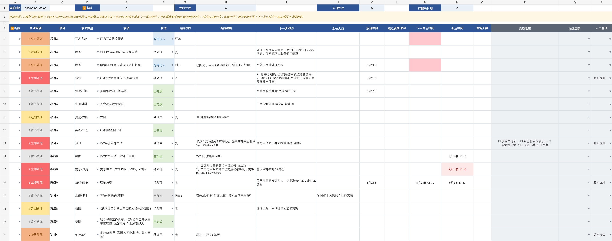

# 个人工作驾驶舱

> **Personal Work Cockpit** — 一个以“大脑卸载”和“下一步推进”为核心的轻量个人工作状态系统。

**正式版：V1.0** · WPS/Excel · 无宏依赖 · 离线可用

## 它解决什么问题

很多工作压力并不是来自“事情很多”，而是来自：事情散落在聊天、系统、文件和脑子里；等待别人时不敢忘；被打断后要重新回忆；每天都要重新扫描一遍全部工作。

个人工作驾驶舱的目标不是记录更多，而是建立一个**可信赖的外部工作记忆**：

- 新事项写进去以后，可以放心从脑子里放下；
- 被会议、消息、临时任务打断后，能快速恢复刚才做到哪；
- 等待别人时先沉底，到该催的时候再自动浮回；
- 每天打开表，优先看到“现在最值得处理什么”；
- 工作日志、项目复盘和汇报素材尽量成为维护当前状态的副产品。

核心判断不是传统的“重要 × 紧急”打分，而是：

> **哪件事晚一两个小时处理，代价最大？**

## 这个产品的特点

- **低维护**：不要求一次填满，不用 1~5 分主观评分，不做复杂项目管理表单。
- **可解释排序**：关注级别由状态、下一关注、截止、加速因素等事实型字段生成。
- **注意力延迟唤醒**：等待他人的事项在下一关注时点之前自动退出注意力。
- **任务断点恢复**：`▶当前 + 当前进展 + 下一步动作 + 定位入口` 用来恢复被打断的工作上下文。
- **球权而非笼统责任人**：记录“下一步现在轮到谁”，更贴近推进工作。
- **时间语义贴近日常工作**：下一关注与交付截止使用不同的上午/下午时点。
- **日志与主表分离**：主表保存“现在”，日志保存“发生过什么”。
- **WPS 友好**：核心能力仅依赖公式、数据验证、条件格式和标准 `.xlsx`。
- **离线优先**：不依赖互联网、宏或在线 AI；可按需用 Python/OpenCode 增强。

## 5 分钟开始使用

1. 下载 [`template/个人工作驾驶舱_V1.0_空白模板.xlsx`](template/个人工作驾驶舱_V1.0_空白模板.xlsx)。
2. 新事项先填最少信息：`项目 / 事项 / 状态 / 当前球权 / 下一步动作`。
3. 如果在等别人：设为 `等待他人`，并填写 `下一关注时间`。
4. 如果事项正式交给其他同事：设为 `已移交`，它会自动退出主动关注。
5. 被打断前，把唯一一个 `▶当前` 留在刚才正在做的事项上。
6. 下班前做一次轻量收口，并按需把有意义的进展写入日志。

想先看完整效果，可打开 [`examples/个人工作驾驶舱_V1.0_示例版.xlsx`](examples/个人工作驾驶舱_V1.0_示例版.xlsx)。

## 四张 Sheet

| Sheet | 用途 |
| --- | --- |
| `工作事项台账` | 当前状态与日常推进主工作台 |
| `工作事项日志` | 历史事件与项目时间线 |
| `使用说明` | 内置使用手册 |
| `下拉列表` | 枚举、候选标签和时间配置 |

## 三个最重要的概念

### 1. 当前球权
不是“谁总体负责”，而是：**下一步动作现在轮到谁**。

### 2. 下一关注时间
不是 deadline，而是：**什么时候这件事必须重新进入我的注意力**。

### 3. 截止时间
是超过后会产生现实后果的业务 deadline。它和下一关注时间必须分开。

## 时间约定

底层保存真实日期时间，显示层尽量使用自然工作语言：

- 下一关注：仅日期/上午 = `08:30`；下午 = `14:30`。
- 截止：上午前 = `12:00`；仅日期/当天前 = `17:30`。
- 有明确时点时直接输入实际时间，如 `15:30`。
- 添加时间、最近更新时间默认只显示月日。

原则：**机器可以精确，人不被迫精确。**

## 产品边界

它刻意**不做**：

- Jira / Project 式团队项目管理；
- 工时与绩效打卡；
- 复杂主观评分；
- 审计级每次编辑留痕；
- 强制把流程拆成大量子任务；
- 在主表里管理全部联系人、文件版本和项目资料；
- 让 Python、AI 或互联网成为核心可用性的前提。

新增功能应优先回答：**它是否真的减少遗漏、重复维护或恢复上下文的成本？**

## 文档

- [使用手册](docs/USER_GUIDE.md) — 普通用户从零开始使用
- [产品原则](docs/PRODUCT_PRINCIPLES.md) — 核心理念、优势、边界与反目标
- [开发指南](docs/DEVELOPER_GUIDE.md) — 给开发者、CodeX/OpenCode/AI 的完整接手规范
- [项目文件管理建议](docs/PROJECT_FILE_GUIDE.md) — 项目文件夹与“当前版 + 历史版”方法
- [机器可读规格](spec/tracker_spec.json) — 字段、规则、公式和视觉约束的事实源

## 兼容性与隐私

当前设计以 **统信 UOS + WPS 企业版** 的实际使用体验为优先，同时保持标准 `.xlsx` 结构。

工作台账可能包含项目名称、人员、聊天线索、内部系统入口和文件路径。公开 Issue、截图、示例或使用公网 AI 前请彻底脱敏。详见 [SECURITY.md](SECURITY.md)。

## 版本

- **V1.0**：首个正式发布版本。
- 此前迭代统一视为 **0.x 内测阶段**，不在公开文档中保留流水账式版本记录。

## License

本项目基于 [MIT License](LICENSE) 开源。

---

> **让大脑负责判断，让表格负责记忆；今天不需要关注的事情，就不要占用今天的注意力。**
